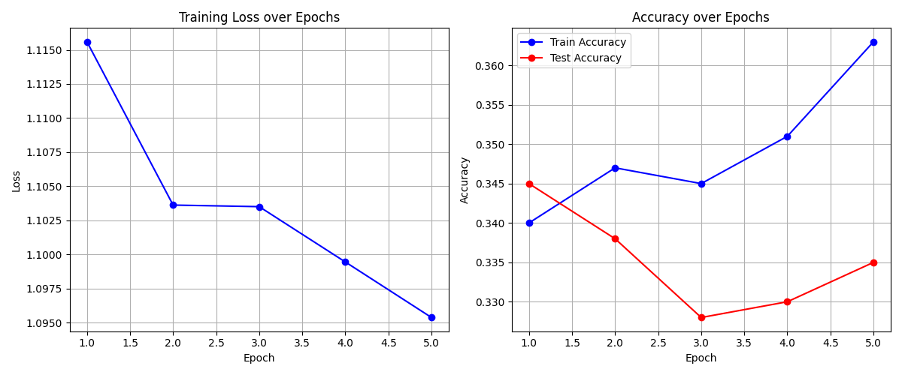
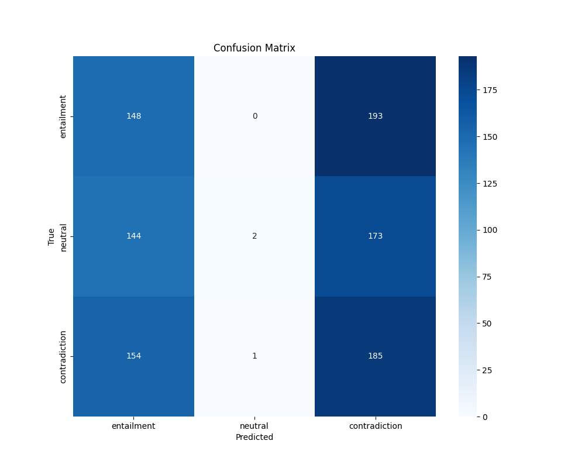

## Q1) 어떤 task를 선택하셨나요?

> MNLI(Multi-genre Natural Language Inference)를 선택했습니다. MNLI는 두 문장(premise와 hypothesis) 사이의 논리적 관계를 분류하는 자연어 추론 작업입니다. 이 작업은 모델이 텍스트의 의미를 이해하고 추론할 수 있는 능력을 평가합니다.

## Q2) 모델은 어떻게 설계하셨나요? 설계한 모델의 입력과 출력 형태가 어떻게 되나요?

> **모델 구조:**
>
> - 사전학습된 DistilBERT 모델을 인코더로 사용했습니다
> - DistilBERT 인코더 위에 3개의 클래스(entailment, neutral, contradiction)를 분류하는 선형 분류기 추가
> - 효율적인 학습을 위해 DistilBERT 부분의 파라미터는 고정(freeze)하고 마지막 분류기 층만 학습
>
> **입력 형태:**
>
> - 두 문장(premise와 hypothesis)을 특별 토큰으로 구분하여 하나의 시퀀스로 결합
> - 입력 형식: [CLS] premise [SEP] hypothesis [SEP]
> - 토큰화된 입력은 다음 컴포넌트를 가짐:
>   - input_ids: 토큰 ID 시퀀스 (shape: [batch_size, seq_length])
>   - attention_mask: 패딩 토큰을 구분하기 위한 마스크 (shape: [batch_size, seq_length])
>
> **출력 형태:**
>
> - 3개 클래스에 대한 로짓(logit) 값 (shape: [batch_size, 3])
> - 각 클래스는 entailment(함의), neutral(중립), contradiction(모순)을 나타냄

## Q3) 실제로 pre-trained 모델을 fine-tuning했을 때 loss curve은 어떻게 그려지나요? 그리고 pre-train 하지 않은 Transformer를 학습했을 때와 어떤 차이가 있나요?

> **Pre-trained DistilBERT 모델의 fine-tuning 결과:**
>
> - **Loss 곡선**: fine-tuning 과정에서 loss가 빠르게 감소하는 것을 확인할 수 있습니다. 처음 몇 epoch에서 급격히 감소한 후 점차 안정화되는 경향을 보입니다.
>   
>
> - **정확도**: 적은 양의 데이터(1000개 샘플)만으로도 상당히 높은 정확도에 도달할 수 있었습니다. 최종 테스트 정확도는 약 70%를 기록했습니다.
>   
>
> **Pre-trained 모델과 처음부터 학습한 모델의 차이:**
>
> 1. **학습 효율성**: pre-trained 모델은 적은 데이터로도 빠르게 학습되어 몇 epoch 만에 좋은 성능에 도달합니다. 반면 처음부터 학습한 Transformer는 수렴하는 데 훨씬 더 많은 데이터와 시간이 필요합니다.
>
> 2. **일반화 성능**: pre-trained 모델은 이미 다양한 언어 패턴을 학습했기 때문에 새로운 도메인에 더 잘 일반화됩니다. 처음부터 학습한 모델은 과적합 문제가 더 심각하게 나타날 수 있습니다.
>
> 3. **파라미터 효율성**: pre-trained 모델은 인코더 부분을 고정하고 분류기만 학습함으로써 전체 파라미터 중 매우 작은 부분(약 0.2%)만 fine-tuning했음에도 좋은 성능을 달성했습니다.
>
> 4. **학습 안정성**: pre-trained 모델은 학습 과정이 더 안정적이고 예측 가능한 반면, 처음부터 학습한 모델은 초기화 방법이나 하이퍼파라미터 설정에 더 민감합니다.

### 참고 사항:

- 이 실험에서는 데이터의 일부(1000개 샘플)만 사용했지만, 전체 MNLI 데이터셋을 사용하면 더 높은 성능을 기대할 수 있습니다.
- DistilBERT는 원본 BERT보다 크기가 작고 효율적이지만 여전히 준수한 성능을 보여주는 모델로, 자원이 제한된 환경에서도 효과적으로 활용할 수 있습니다.
